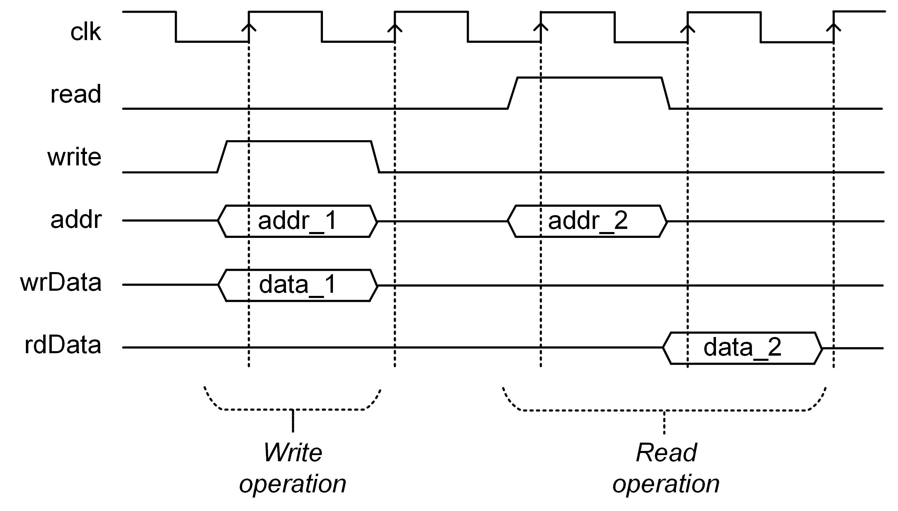

<!-- headingDivider: 3 -->

# Welcome to 02114 <br> Design of a RISC-V Microprocessor
by Martin Schoeberl

January 2025 version given by Luca Pezzarossa
<br><br>
Technical University of Denmark (DTU)

# Welcome!

- 3-week intensive course
- Hands-on hardware design

- The course manual and material is on the Gibhub repository at [https://github.com/schoeberl/risc-v-lab](https://github.com/schoeberl/risc-v-lab)

**Important note: Before starting with the design and implementation (i.e. coding), please read this document top-to-bottom, so you know the overall requirements, expectations, and suggestions.**

# Welcome!

- 3-week intensive course
- Hands-on hardware design

- The course manual and material is on the Gibhub repository at [https://github.com/schoeberl/risc-v-lab](https://github.com/schoeberl/risc-v-lab)

**Important note: We will use DTU-Learn for announcemnts. Please activate the notifications.**

# <br><br>General course information

## Aim

- Consolidate your knowledge and skills in: 
  - Computer architecture 
  - Digital hardware design

- You will:
  - Design and implement your **own** RISC-V microprocessor
  - Run **your** processor in your Basys3 board (or an equivalent one)

## Learning objectives - I

A student who has met the objectives of the course will be able to:
- **Apply** the principles of pipelining and **leverage** its benefits in digital system design
- **Use** the RISC-V architecture, its instruction set, and its implementation in digital systems
- **Gain** proficiency in Chisel, a hardware construction language used for digital system design
- **Design** and **implement** each stage of a pipelined RISC-V processor on an FPGA

## Learning objectives - II

- **Use** simulation tools to verify the correctness of digital system designs
- **Gain** experience in debugging digital system designs
- **Work** effectively in small teams to design and implement a complex digital system
- **Integrate** individual designs into a fully functional pipelined RISC-V processor
- **Evaluate** the performance and quality of the final design based on various metrics

## Practicalities

- The course will start **Monday, January 6th, 2025** at **10:00**
- The course will be in **Building 324 - Room 070**
- The room is reserved for the entire 3-week period from 8:00 to 17:00
- The room and the foyer of Building 324 are suitable for group work
- The last day of the course is **Friday, January 24th, 2025**, when we will have the exam

## Teaching and supervision - I

- This is a practical course where you learn-by-doing
- We will try to keep frontal teaching to a minimum:
  - One scheduled presentation today
  - Other frontal lectures if needed

- We expect that working independently
- We strongly encourage you to seek help whenever needed

## Teaching and supervision - II

- We will have the following supervised sessions:
  - Everyday **from 10:00 to 11:00**
  - Everyday **from 14:00 to 15:00**

- We have a discussion forum (Discord server) for you to ask questions, share ideas, and collaborate with your peers
  - See link in DTU-Learn

## Group forming
- Work carried out in **groups of 4 people** 
  - Groups of 2 or 3 are also possible but less preferred
  - You are free to select your group members

- **Groups should be registered as soon as possible in the DTU-Learn group forming facility.**

- Make sure that you align expectations between the members
  - Discuss about each member’s availability, work habits, and goals for the course

## Presence and review meetings

- We recommend **being present** during course hours in the course classroom
    - Make the most of the available resources and support

- Two mandatory review meetings
  - Review meeting 1: **Friday, January 10th, 2025**
  - Review meeting 2: **Friday, January 17th, 2025**

- Present your current progress, demonstrate any working components, and discuss any issues you are facing

## Exam
- Exam is on **Friday, January 24th, 2025** (the last day of the course)

The exam consists of:
- A presentation of your processor (give your processor a name)
- A demo of your processor on the FPGA board
- Highlights from your code
- Deliverables

## Deliverables

- **Short report:** A short report describing your processor and your work

- **Source files:** All the source code of your implementation and tests

- **README file:** A README file that includes instructions

<br>

**IMPORTANT: See requirements and deadlines on the course manual**


## FPGA board
- If you have your own FPGA board 
  - You are expected to use it in this course
<br> 
- If you do not have a board
  - You can borrow one
  - Ask the teacher

# <br><br>Your RISC-V microprocessor

## Main objective
- You are required to implement a RISC-V processor **from scratch** 
- This includes:
  - The processor itself
  - Some peripherals of your choice
  
- This course offers a lot of freedom
  - No predefined hardware structure or template
  - You should explore, experiment, and develop a processor **that reflects your own design choices**

## Objective summary
- You are expected to:
  - Design and build a fully functional RISC-V microprocessor
  - Test it in simulation to ensure correctness
  - Implement it on an FPGA to verify hardware functionality
  - Develop and run demo programs to showcase its capabilities
<br>
- These objectives will be used for the evaluation (grading)

## Requirements - I
<style scoped>
ul {
    font-size: 30px;
}
</style>

- The processor shall implement the RISC-V RV32I instruction set
- The processor shall be pipelined
- The processor shall be able to run a simple program in simulation and on an FPGA
- You are allowed (and we recommend) to split the memory into instruction and data memory
- No need to implement caches
- You do not need to support unaligned memory access
- You need to have at least one output peripheral (e.g., GPIO/LEDs, UART, 7-segment display, buttons, switches, etc.)

## Material - I
<style scoped>
ul {
    font-size: 25px;
}
</style>

- **Reading material**
  - Andrew Waterman's PhD thesis on the RISC-V ISA: [Design of the RISC-V Instruction Set Architecture](https://www2.eecs.berkeley.edu/Pubs/TechRpts/2016/EECS-2016-1.html)
  - The textbook [Computer Organization and Design RISC-V Edition](https://www.amazon.com/Computer-Organization-Design-RISC-V-Architecture/dp/0128203315): The Hardware Software Interface, 2nd Edition, by David A. Patterson (Author), John L. Hennessy (Author)

- **Useful links**
  - The lab material for the CAE course at DTU: [02155 Computer Architecture and Engineering Lab](https://github.com/schoeberl/cae-lab)
  - Material and installation instruction for the Digital Electronics 2 course at DTU: [02139 Digital Electronics 2](https://github.com/schoeberl/risc-v-lab)
  - [The RISC-V Instruction Set Manual](https://riscv.org/specifications/)

## Material - II
<style scoped>
ul {
    font-size: 25px;
}
</style>
- **Useful links (continues)**
  - [Venus RV32I simulator](https://kvakil.github.io/venus/)
  - [RIPES RISC-V simulator](https://github.com/mortbopet/Ripes)
  - [RISC-V Green Card](https://dejazzer.com/coen2710/lectures/RISC-V-Reference-Data-Green-Card.pdf)
  - [RISC-V Tools (GNU Toolchain, ISA Simulator, Tests)](https://github.com/riscv/riscv-tools)
  - [Rocket Chip Generator (including the RISC- tools)](https://github.com/freechipsproject/rocket-chip)
  - [A RISC-V tutorial](https://github.com/BrunoLevy/learn-fpga/blob/master/FemtoRV/TUTORIALS/FROM_BLINKER_TO_RISCV/README.md)

- **DTU-Learn material**
  - Slides on the RISC-V pipeline from course 02155
  - Slides on memory, bus, and interfaces from course 02139

#  <br><br>About peripherals

## General - I 
- Peripherals are an essential to interact with the external world

- We offer two basic **memory-mapped** peripherals to get you started
  - **LED controller**: for LEDs control
  - **UART transceiver** for serial communication

- Peripherals are connected to a **simple system bus**, allowing you to read and write data through memory-mapped IO

## General - II

- About **memory-mapped IO**...

- **IMPORTANT:** If you wish to extend your system with additional peripherals, feel free to experiment or reach out for guidance

## System bus - I

| name  | width | description                      |
|---------|-------|--------------------------------------------------------|
| `read` | 1   | signal a read operation                |
| `write` | 1   | signal a write operation                |
| `addr` | 32  | address for read or write               |
| `wrData`| 32  | data to write                     |
| `rdData`| 32  | result of read (valid one cycle after `read` is asserted) |

## System bus - II



## LED controller - Register map

| address | read              | write              |
|---------|--------------------------------|---------------------------------|
| 0x00  | read n-bit LED status     | set n-bit LED status      |

- Has only a single memory-mapped register with one bit per LED

## UART - Register map
<style scoped>
ul {
    font-size: 25px;
}
</style>


| address | read              | write              |
|---------|--------------------------------|---------------------------------|
| 0x00  | read received data from buffer | write data to send into buffer |
| 0x04  | read UART status (bit 0: tx ready and bit 1: rx has data) | -  |


- Reading from address 0x00 will remove a character from the receive buffer 
  - If the buffer is empty, no valid data is returned
- Writing to address 0x00 will add a character to the transmit buffer 
  - If the buffer is full, the character will be dropped


## Connecting multiple peripherals
To integrate multiple peripherals into your system:
- Each device must be assigned its **own address range** (e.g., multiples of 1 kB)
- The system bus must direct `read` and `write` signals to the appropriate device based on the address
- The routing decision must be retained to ensure the correct response is provided by the selected peripheral
- **It is up to you to implement this!**


# <br><br>Suggested work plan

## General

- Begin with a **minimum viable product (MVP)**
  - **Start with a single instruction** to establish the core pipeline behavior
  - Develop an MVP implementation of all pipeline stages:
    - **Fetch, Decode, Execute, Memory, Writeback**
  - Write **tests** to validate each pipeline stage and the instruction flow
  - Gradually **add more instructions** once the MVP is functional and tested

## Fetch stage
- Implement the fetch stage to read instructions into your pipeline
- Start with a simple mechanism, such as reading from ROM
- Use **simple assembler tests** to validate functionality
- Tools:
  - Compile assembler programs with **RV GCC** or **Venus**
  - Debug execution using waveform viewers like **GTKWave**

## Decode stage
- Extract **opcode** and **register numbers**
- Decode instructions using a `switch` or equivalent logic
- Integrate the **register file** for input data
- Write tests to verify decoding and handle valid instructions

## Execute stage
- Implement the **`addi` instruction** for basic arithmetic
- Add an **Arithmetic Logic Unit (ALU)** for operations like `add` and `sub`
- Validate ALU and execution stage with targeted tests

## Memory stage
- Support **load (`lw`)** and **store (`sw`)** instructions
- Ensure interaction with data memory is correct
- Test memory read/write operations thoroughly

## Writeback stage
- Implement logic to write results back to the register file
- Explore variations:
  - Is a separate writeback stage needed?
- Validate the full pipeline with end-to-end instruction tests

## Start with a single instruction

- Begin with a single instruction, e.g., **`addi`**:
```asm
addi x1, x0, 0x123
```
- Hardcode instruction in the fetch stage for testing
- Observe pipeline progression and write tests

## Example program
```asm
addi x1, x0, 0x111
addi x2, x0, 0x222
nop
nop
nop
add  x3, x1, x2
```
- Simulate execution with additional instructions like `add` and `nop`
- Debug with waveform viewers

## Assemble and validate programs
- Assemble simple programs manually or with Chisel `Vec()`
- Use **Venus** for assembler programs
- For larger programs, switch to **gcc** or **as**
- Streamline compilation and loading for efficient testing

## Summary
- Focus on **small, incremental steps**
- Validate each stage thoroughly before moving forward
- Use waveform viewers to observe and debug instruction flow
- Test frequently to ensure reliability and confidence in your design

# <br><br>When to start with your FPGA board?

## When to start with your FPGA board?

Aim to start as soon as possible
- Blinking LED is the embedded version of "Hello World"
  - If you can blink an LED, you can do everything
- You need `bge` and `sw` for that, besides `addi` and `nop`
  - **That's it!**
- Aim for a blinking LED at the end of the 1st week of the course

# <br><br>Notes, hints, and tips

## 1: Pipeline design
 - Place pipeline registers at the **input of each stage** for simplicity
 - For the memory and register file stages, having a register at the input is particularly helpful

## 2: Register file debugging
 - Use a **Reg** for the register file during debugging:
 ```scala
 RegInit(VecInit(Seq.fill(32)(0.U(32.W))))
 ```
 - For improved performance and resource efficiency, transition to **on-chip memory**:
 ```scala
 SyncReadMem(32, UInt(32.W))
 ```

## 3: Handling data hazards
 - **Stalling** can be used to address data hazards, but it may affect performance
 - **Forwarding** is a more efficient solution and provides better overall performance

## 4: Testing and integration
 - Begin testing and integrating components **from day one** to identify and resolve issues early

## 5: Interpret resources critically
 - Use the provided resources as inspiration to develop your own implementation

## 6: Design documentation
 - Always **draw a block diagram**:
  - It will help you understand and communicate your design
  - Include it in your abstract or presentation

## 7: Signal management
 - Use **Bundles** (Chisel) or **records** (VHDL) to group signals logically and cleanly
 - Replace magic numbers with **enumerations** for readability and maintainability:
  - Example: Use `op_add` instead of `123`


# <br><br>Testing and debugging

### Benefits of testing
- Facilitates debugging during development
- Enables creation of a test suite for continuous validation
- Advanced features:
  - Regression testing
  - Continuous Integration (CI) with GitHub

## Tips for testing and debugging
- Visualize signals and behavior with a waveform viewer
- Add `printf` statements in Chisel to monitor signals
- Observe instructions step by step through the pipeline

## What to test
- Individual components like:
  - ALU
  - Decode stage
  - Instruction fetch
- Prioritize worthwhile testing:
  - Example: ALU addition may not need exhaustive tests if you use `+`

## Processor-level testing
- Simpler than unit testing:
  - Execute programs and check functionality
- Validates entire system and component interactions
<br>
- Self-testing programs
- Cosimulation

## Self-testing programs
- Write programs with known results
  - Example: Signal success with `0` in `x1`
- Use tools like **ChiselTest** or VHDL benchmarks

### Example test
```asm
addi x1, x0, 0x123
addi x2, x0, 0x111
addi x3, x0, 0x222
add x1, x2, x3
addi x1, x1, -0x333
```
- Expected: `x1` finishes with `0`

## Available tests (advanced)
- **riscv-tests:** Comprehensive RV32I test cases
- **ripes:** Longer self-tests
- **CAE Course 02155:** Familiar basic tests
- Tests signal results using the `ecall` instruction
- Register dumps available for validation

## Cosimulation (Advanced)
- Run programs on both processor and simulator (golden model)
- Compare execution traces or operate in lockstep
<br>
- Traces include fields like PC, instruction, register writes, and memory operations
- Use for step-by-step comparison
<br>

- **For details, refer to the course manual**

# More advanced notes

## Bootloader 
- Simplifies program loading via serial port
- Avoids FPGA resynthesis for updates
- Can be implemented as a state machine
<br>

- **For details, refer to the course manual**


## Using ELF executables
- Load and extract sections using `lib.Executable`
- Example Scala code:
```scala
val exe = Executable.from("path/to/myElf.out")
val text = exe.getSection(".text")
text.getWords // Seq[Long] of instructions
exe.getEntryPoint // Start PC
```
<br>

- **For details, refer to the course manual**

# <br> Let's get to work!
**02114 - Design of a RISC-V Microprocessor** 
by Martin Schoeberl
(January 2025 version given by Luca Pezzarossa)
<br><br>
Technical University of Denmark (DTU)